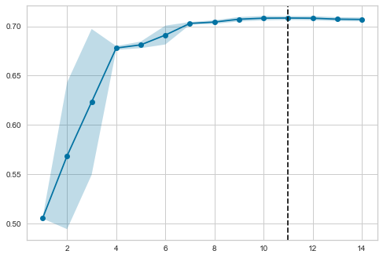
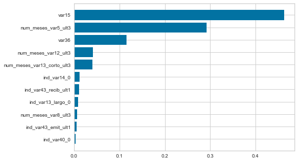
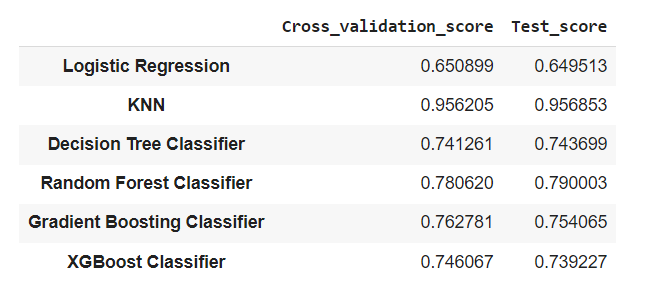

 

# Dimensionality Reduction - Customer Satisfaction Prediction

 </img>
</img>

 

## Problem Context

Santander Bank was asking Data Scientists to help them identify **dissatisfied** customers at the beggining of the relationship. This would allow Santander to create proactive measures in order to retain that client.

For this project, it was requested an **accuracy of, at least, 70%**.

The dataset consisted of many anonymous features from different customers that demanded the use of **dimensionality reduction** tools.

## Feature Reduction

### First reduction: Variance Threshold

The **variance** is simply the average of the squared differences from the mean. It is import in the context of machine learning because features with 0 or close to 0 variance are generally **useless** in terms of prediction power.

For the purpose of this project, we made use of the `VarianceThreshold` estimator. It selected all the features in our dataset whose variance is higher than a set threshold.

* After it, we were able to **eliminate** a great number of columns, 325 to be exact. This result showed us that many features in our initial dataframe were potentially useless to be used as predictors.

### Second reduction: Multicollinearity

Multicollinearity refers to the occurance of high **intercorrelations** among two or more independent variables. 

Multicollinearity causes problems in the interpretability of the model result, for this reason it is advisable to drop features that present high correlation with each other.

* Once again, we were able to **reduce** the dimensionality of the dataframe.

### Third reduction: Recursive Feature Elimination

Recursive Feature Elimination, or RFE for short, is a feature reduction method that works by **recursively training** diferent sets of features and ranking them by their importance with the use of an estimator.

The supervised learning estimator needs to provide information about feature importance. For the purspose of this project, we used `Logistic Regression` as the auxiliary model.

 

* RFECV model achieved the highest accuracy model with **11 features**.

### Fourth reduction: Random Forest Feature Importance

The ensemble estimator **Random Forest** has the property `Feature Importance`, which returns us the features that contribute most to the reduction of the Gini impurity criterion.

We made used again of the `Pipeline`, `RobustScaler` and  `SMOTE` methods and test the **accuracy** of the model with cross validation.

 

* It is interesting to note that only a few features in our dataframe were responsible for most of the power of prediction.

## Testing predictive models

At this part of the project, we tested different algorithms using the final set of features that we found in our fourth reduction step. Our goal was to improve or at least keep our current accuracy score.

 

* We could see that the `KNN` model had the **highest scores** in both validation and testing set, followed by `Random Forest Classifier`.

However, it is possible that the `KNN` was privileging the class that has more data to the detriment of balancing accuracy. For this reason, and according to the results obtained previously, we chose to proceed with the model `Random Forest Classifier`. In the follow, we tried to **optimize the hyperparameters** of the chosen model with the help of the `GridSearchCV` technique.

## Final Considerations

It is essential for a financial institution that customers **dissatisfied** with its services are quickly identified and preventive measures are taken to resolve this situation.

This work is essentially relevant for established banks, where the competition with new digital players requires precise initiatives in order to **retain these customers**.

This project involved a typical problem within Data Science, which is the ability to **reduce the dimensionality** of the dataset, since the creation of predictive models in this situation could lead to inaccuracies in results and a decrease in decision speed.

At the end of the work, we were able to train a `Random Forest` prediction model with an average **accuracy of 83%**.

In order to improve the model performance, the following strategies may be further studied:

* Other techniques for dimensionality reduction, like PCA, could be studied;
* The original testing dataset could be used somehow;
* Other oversampling and undersampling techniques could be used;
* More models or even a blend of models could be tested.
